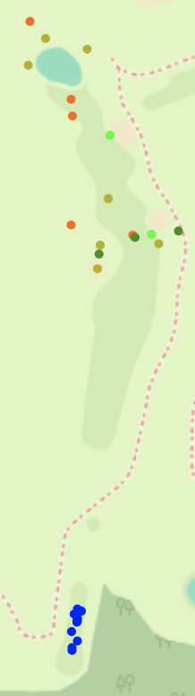

# Forehead Heat Maps

This is a proof of concept. The intention of this project is to demonstrate easy capabilities for building heated dot-maps using shot data from [Forehead](https://github.com/evklein/forehead)

